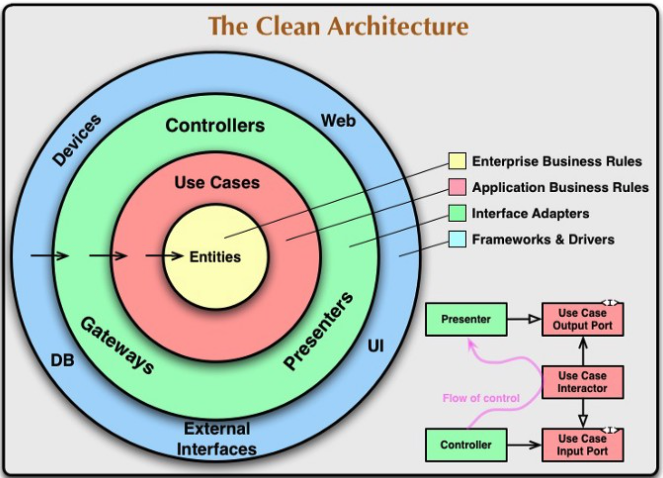

# File Structure
It will reflect Domain Driven Design principles; I'll base it on Yusuke Hatanaka [Clean Architecture in Go](https://medium.com/@hatajoe/clean-architecture-in-go-4030f11ec1b1). I'll modify it slightly to reflect some ideas I have about how to evolve the `OO Entities` into a paradigm reflecting the atomic nature of µ-services and a seamless integration of their data models.

# Clean Architecture
`Clean architecture` has some the following layers:


There are 4 layers, blue, green, red and yellow layers there in order from the outside:
**_external_** - the blue layer
**_interface_**: the green layer
**_usecase_**: the red layer
**_domain_**: the yellow layer

A key concept is to ensure The most important thing about clean architecture is to make interfaces through each layer.

We will use the `Clean Architecture` model to implement a `Domain Driven Design` architecture using the folder structure discussed in this document.

# The structure
```text
.
├── Makefile
├── README.md
├── app
│   ├── domain
│   │   ├── model
│   │   ├── repository
│   │   └── service
│   ├── interface
│   │   ├── persistence
│   │   └── rpc
│   ├── registry
│   └── usecase
├── cmd
│   └── td
│       └── main.go
└── vendor
├── vendor packages
|...
```

The top directory contains three directories:
- **_app_**: application's packages root directory
- **_cmd_**: application's main package directory
- **_vendor_**: application's vendor packages directory

## Domain - Yellow Layer
Hosted at the `app/domain` folder, a.k.a. `Entity`, it is at the core of the `Clean Architecture`, it holds the `Enterprise Businees Rules` and has three packages:
- **_model_**: has aggregate, entity and value object; perhaps here is where we represent the `Forms`;
- **_repository_**: has repository interfaces of aggregate; perhaps here is where we represent the `Shadows`;
- **_service_**: has application services that depend on several `Shadows`;

### Model
With time the `model` package will grow to aggregate many `Forms` and related `Value Objects`:
```go
package model

type ClubMember struct {
	id string
	first string
	email string
}

func NewCluMember (id string, first string, email string) *ClubMember {
	return &ClubMember{
		id:    id,
		first: first,
		email: email
	}
}

func (cm ClubMember)  Id () string {
	return cm.id
}

func (cm ClubMember)  First () string {
	return cm.first
}

func (cm ClubMember)  Email () string {
	return cm.email
}
```

### Repository
They are the `in-memory` data structures used to model our `Forms`. They might, but not always do, mimic the data structures used to persist the system state. We inject an infrastructure layer between the repository and the persistence hardware to translate between them and to enable seamlessly replace hardware persistence. (TODO: need to flush this out):

```go
package repository

import "github.com/RodrigoMattosoSilveira/go-swiss-pairing/app/domain/model"

type ClubMemberRepository interface {
	// FindAll find all club members
	FindAll() ([]*model.ClubMember, error)
	// FindByEmail find a club member with the given email
	FindByEmail(email string) (*model.ClubMember, error)
	// Save club member with
	Save(*model.ClubMember) (*model.ClubMember, error)
}
```

****NOTE** that this layer does not know where the `Club Member` `Form` is saved or serialized.

### Service
Here we implement logic to manipulate the models. For exampleto validate that the `Club Member email` is unique we would write something like:
```go
func (u *ClubMember) Duplicated(email string) bool {
        // Find club member by email from persistence layer...
}
```

The `Duplicated` function is business logic that does not belong in the `Club Member` model. We solve it by ading a service layer like below:
```go
package service

import "github.com/RodrigoMattosoSilveira/go-swiss-pairing/app/domain/repository"

type ClubMemberService struct {
	repo repository. ClubMemberRepository
}

func (s *ClubMemberService) Duplicated(email string) error {
	clubMember, err := s.repo.FindByEmail(email)
	if clubMember != nil {
		return fmt.Errorf("%s already exists", email)
	}
	if err != nil {
		return err
	}
	return nil
}
```

## Use Cases - Red Layer
Hosted at the `app/usecase` folder, it holds units of one operation, such as registering and listing `club members`, as suggested by the following interface:
```go
type UserUsecase interface {
    ListUser() ([]*User, error)
    RegisterUser(email string) error
}
```
 
A more comprehensive `Club Member` implementation would be something like:
```go
type clubMemberUsecase struct {
    repo    repository.ClubMemberRepository
    service *service.ClubMemberService
}
func NewClubMemberUsecase(repo repositoryClubMemberRepository, service *service.ClubMemberService) *clubMemberUsecase {
    return &ubMemberUsecase {
        repo:    repo,
        service: service,
    }
}
// ListClubMember list all club members
func (cm *clubMemberUsecase) ListClubMember() ([]*ClubMember, error) {
    clubMembers, err := cm.repo.FindAll()
    if err != nil {
        return nil, err
    }
    return toClubMember(clubMembers), nil
}
// RegisterClubMember Register a new club member
func (cm *clubMemberUsecase) RegisterClubMember(first string, email string) error {
    uid, err := uuid.NewRandom()
    if err != nil {
        return err
    }
    if err := u.service.Duplicated(email); err != nil {
        return err
    }
    clubMember := model.NewClubMember(uid.String(), first, email)
    if err := u.repo.Save(clubMember); err != nil {
        return err
    }
    return nil
}
```

`clubMemberUsercase` depends on two packages, i) repository.ClubMemberRepository interface and ii) *service.ClubMemberService struct. Above, we injected  these two packages when we initialized clubMemberUsecase. An alternate and more efficient mechanism to set up those dependencies is to use a DI container, which we will discuss shortly.

Also, note that `FindAll` above retrieves `Model.ClubMembers`, not `ClubMembers` encapsulating undesirable business know how when retrieving ClubMembers; hence we expanded `Model.ClubMember` to include logic, `toClubMember` to return only `ClubMembers`:
```go
type ClubMember struct {
    id string
    first string
    email string
}
...
func toClubMember(clubMembers []*model.ClubMember) []*ClubMember {
    res := make([]*ClubMember, len(clubMembers))
    for i, clubMember := range clubMembers {
        res[i] = &ClubMember{
            ID:    clubMember.GetID(),
			First:  clubMember.First,
            Email: user.GetEmail(),
        }
    }
    return res
}
```

## Interfaces - Green Layer
Hosted at the `app/interface` folder, it holds concrete objects like API endpoint handlers, data repository, and RPC:
- **_persistence_**: Logic to handle the domain data, `Forms`, in memory and persistence; 
- **_rpc_**: API to access `Forms' Shadows`

### Persistence
Hosted at the `app/interface/persistence folder`, below is a concrete implementation of the repository, in memory; we would require a different one to persist it in another medium:
```go
type clubMemberRepository struct {
    mu    *sync.Mutex
	clubMembers map[string]*ClubMember
}

// NewClubMemberRepository return the repo
func NewClubMemberRepository() *clubMemberRepository {
    return &clubMemberRepository {
        mu:    &sync.Mutex{},
        clubMembers: map[string]*ClubMember{},
    }
}

// FindAll find all club members 
func (r *clubMemberRepository) FindAll() ([]*model.ClubMember, error) {
    r.mu.Lock()
    defer r.mu.Unlock()
    clubMembers := make([]*model.ClubMember, len(r.clubMembers))
    i := 0
    for _, clubMember := range r.clubMembers {
        clubMembers[i] = model.NewClubMember(clubMember.ID, clubMember.First, clubMember.Email)
        i++
    }
    return clubMembers, nil
}

// FindByEmail find a club member based on their email
func (r *clubMemberRepository) FindByEmail(email string) (*model.ClubMember, error) {
    r.mu.Lock()
    defer r.mu.Unlock()
    for _, clubMember := range r.clubMembers {
        if clubMember.Email == email {
            return  model.NewClubMember(clubMember.ID, clubMember.First, clubMember.Email), nil
        }
    }
    return nil, nil
}

// Save Add a new Club Member
func (r *clubMemberRepository) Save(clubMember *model.ClubMember) error {
    r.mu.Lock()
    defer r.mu.Unlock()
        r.clubMembers[user.GetID()] = &ClubMember {
        ID:    clubMember.GetID(),
		First:  clubMember.GetFirst(), 
        Email: clubMember.GetEmail(),
    }
    return nil
}
```

Note that, regardless the medium, the `Model.ClubMember` remaining unchanged, remaining oblivious of the actual implementation:
```go
type ClubMember struct {
    ID    string
	First string
    Email string
}
```

### RPC
Hosted at the `app/interface/rpc` folder, we will use gRPC to provide repository access to external sources:
TODO Add this

## Direct Injection
`Dependency injection` (DI) is a software pattern that calls to initialize an object at its creation time, using their already initialized dependencies. We will use [Wire](https://github.com/google/wire) a code generation tool that automates connecting components using dependency injection.
TODO Add this